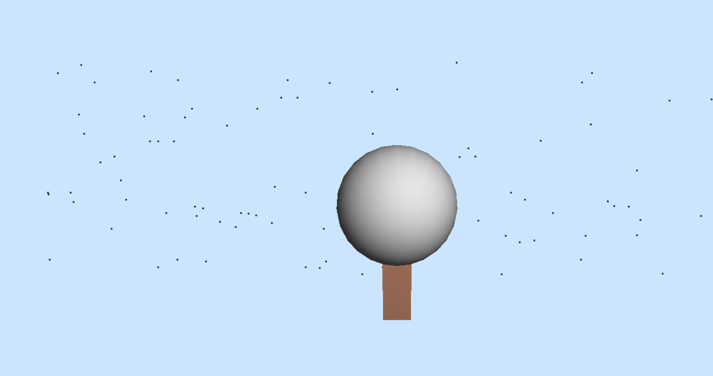

# 🌳 OpenGL Seasonal Scene – Summer & Winter 🌨️

This OpenGL project visualizes a 3D scene that switches between **Summer and Winter**, with **dynamic animations** like birds, snowfall, and stars. It uses `GLUT` and `OpenGL` functions for rendering realistic seasonal effects.

## 🖥️ Features

- ☀️ **Summer Mode**: Green tree, flying bird, pink flowers
- ❄️ **Winter Mode**: Snow-covered tree, falling snowflakes
- 🌌 **Night Mode**: Twinkling stars in the sky
- 🔄 Smooth transitions and animations

## ⌨️ Controls

| Key | Action           |
|-----|------------------|
| `S` | Set to **Summer** |
| `W` | Set to **Winter** |
| `N` | Switch to **Night** |
| `D` | Switch to **Day**   |

## 🛠️ Requirements

- OpenGL
- GLUT
- C++ Compiler (like GCC or Visual Studio)

## 🚀 How to Run

1. Clone or download this repository
2. Open the `.cpp` file in Visual Studio or any C++ IDE
3. Build and run the project

## 🖼️ Screenshots

### 🌞 Summer Day (with bird and flowers)

### 🌌 Winter Night (with snowfall and stars)

### ❄️ Winter Day (snow-covered tree and falling snow)

---

